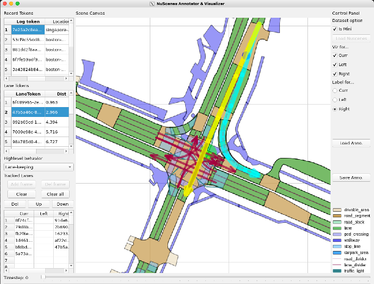

# NuScenes Visualization and Annotation Tool

[<ins>Reliable Autonomous Systems Lab @ MIT (REALM)</ins>](https://aeroastro.mit.edu/realm/)

[<ins>Yue Meng</ins>](https://mengyuest.github.io/)

> A simple visualization and annotation tools for Nuscenes prediction dataset.

## Features
1. Visualize the scenes from the Nuscenes dataset
2. Label the centerlines of the ego vehicle (left/current/right ones) 
3. Label the high level behavior of the scene
4. Can export and load the data in pickle file

## Pre-requisite
1. Downloaded the NuScenes dataset (follow instructions on [NuScenes website](https://www.nuscenes.org/nuscenes))
2. Install GUI support: `pip install nuscenes-devkit pyqt numpy matplotlib pickle`

## Quick run
1. `python gui_main.py --nuscenes_data_dir YOUR_PATH`
2. (You can also run `python gui_main.py` if your data is downloaded to `../../dataset`)

## Detailed tutorials
TBD
